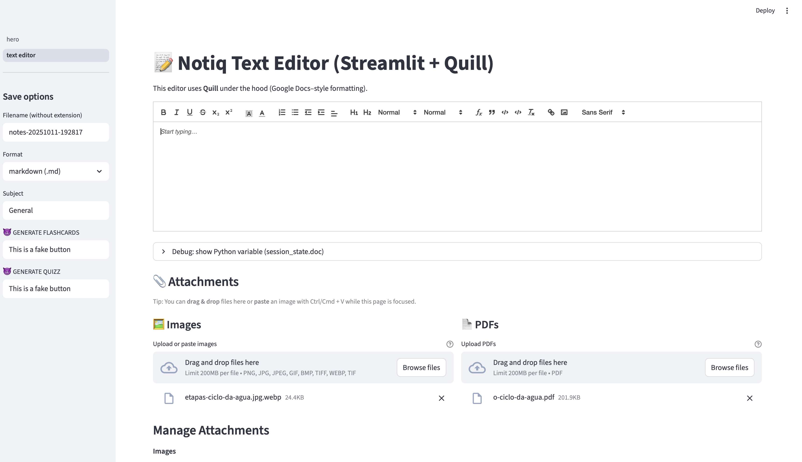

How do yoy create a new subject?
How do you navigate the page?
How do you save the file to the database? Is it a PDF? A Markdown? Do files get immediately transformed?

Perhpas, better employment of this would be to have 2 tables:
1- store original text

2- smart template retrieval- make sure this does not hallucinate

PS.: At the moment, the text editor is saving the files locally as a md file.

I like to store screenshots of powerpoints on my notes. How can i store them?

How can I retrieve my notes everytime?

11/10
Logging progress

Today I did:
- Prototype the text editor + features
- Get the Gemini kinda working with the summary button working
- Get some ideas as to how the database integration + rendering is going to work out

My thoughts:
- Gemini integration needs to be more explored in the sense of RAG, fine tuning, monitorisation, etc
- Datatype integration also needs more thoughts
- Perhaps streamlit is very limited and little customisable, but react might not be the best employment due to backend integration complications
- Markdown format is best for everything. Precisely because of good code sanitisation. Thus, further layouts and banana squases should be rendered from markdown info, 
put up as images, and stored + rendered in buckers supabase

- Diagramas com use cases
    Steps para as pessoas usarem
- Architecture diagrams